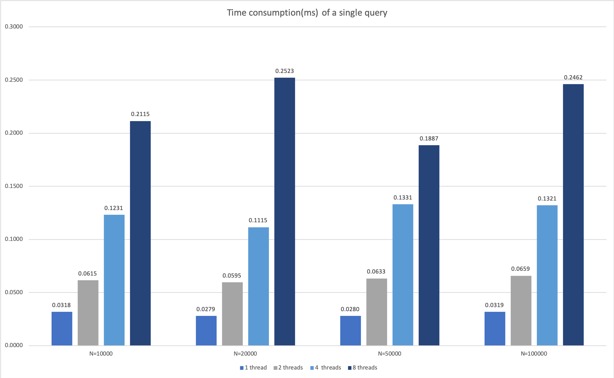

# KVIndex

A simple hash index implementation for random-read-only key-value storage.

## Usage

1. Call `KVIndex.initialize(filename)` to create index and initialize.
2. Concurrently call `KVIndex.get()` to query.

## Benchmark

Platform: 2.4GHz 2-core CPU, 16 GB RAM, 512 GB APPLE SSD

The benchmark shows that the number of `N` has little effect on query performance. 

However, due to the bottleneck of disk I/O, multithreading can hardly increase query performance.

## Implementation

The project implements a hash index for query-only key-value storage.

All indexes are stored in the disk. There are totally (by default) 512 index files.

An index file consists of several slots, each slot is (by default) 13 bytes, containing key_size, address, value_size, and next_slot_id. Collisions are handled with linked lists, where next_slot_id is used.

A query first calculates the hashcode of the key. Secondly, the address of the corresponding record is retrieved from the index file. At last, read the value from the data file and return it. The second and third steps may repeat some times if there are hash collisions. 

With a good hash function, the amortized number of disk accesses for each query is 2.

## Future work

There are a few major factors that can be optimized to improve performance, especially in a concurrent environment.

1. [ ] better hash function
2. [ ] memory buffer
3. [ ] parallel initialization
4. [ ] I/O optimization

## Contact

Please e-mail me to ekexium@gmail.com for any suggestions.